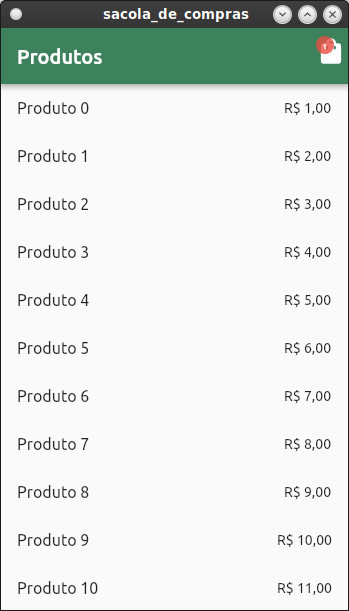
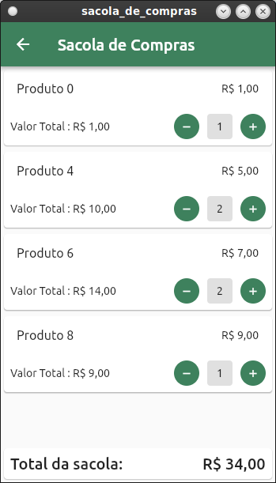

# sacola_de_compras

Projeto Sacola de Compras usando Mobx com geração de código(Flutter/Dart) - projeto criado para cumprir o assignment #LevelUP5 da Raro Academy.

## Telas Construídas

### - Print de tela HomePage

 

### - Print de tela Sacola de Compras

 

